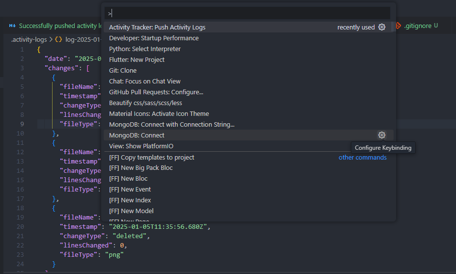
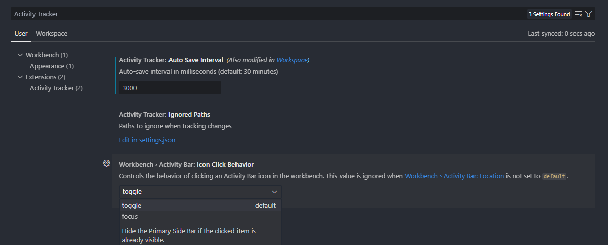
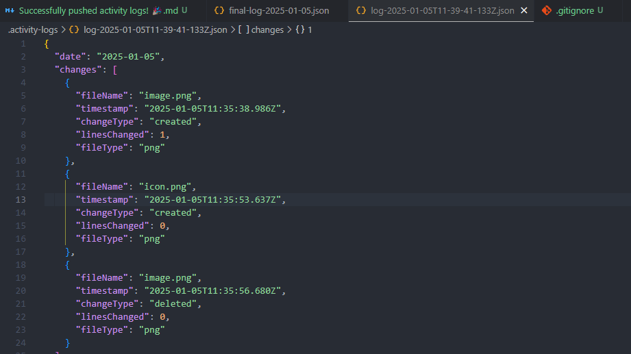
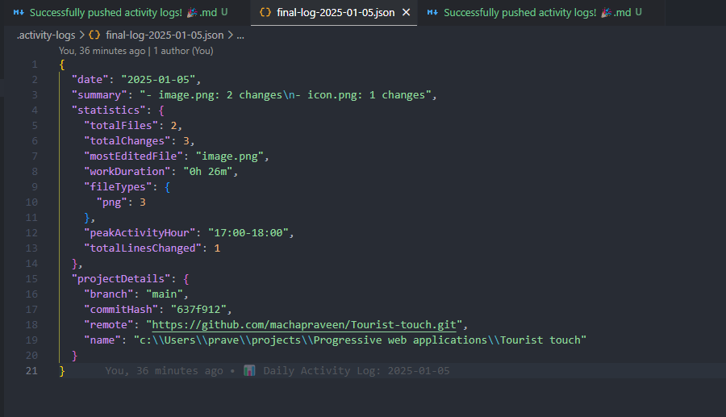
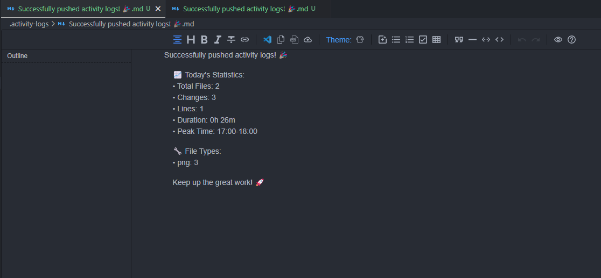
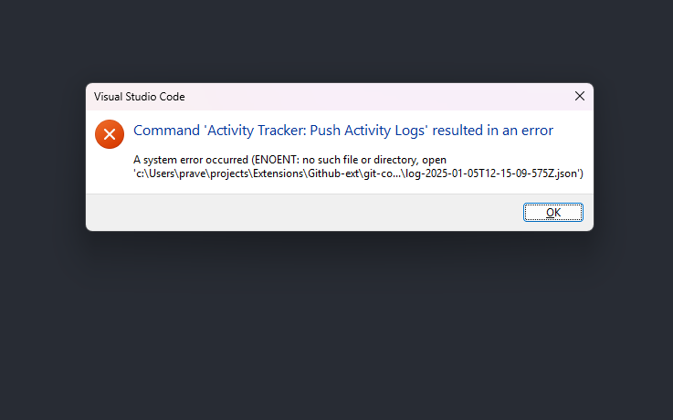

# Push Activity Logs - GitHub Contribution Tracker

Track your coding activity and maintain your GitHub contribution streak automatically! This extension monitors your file changes and helps you maintain a consistent contribution history.

## Features

- 📊 **Tracks all file changes** in your workspace.
- ⏱️ **Automatically saves activity logs** periodically.
- 🔄 **Maintains daily summaries** of your coding activity.
- 📈 **Generates detailed statistics** about your work.
- 🚀 **One-click push** to maintain your GitHub streak.

## Installation

### 1. Install the Extension

1. **Open Visual Studio Code (VS Code)**.
2. **Go to the Extensions Marketplace**:
   - In the left sidebar, click on the **Extensions** icon (it looks like a square with four smaller squares inside).
3. **Search for the Extension**:
   - In the search bar, type **"Push Activity Logs"** or **"git-contributions"**.
4. **Install the Extension**:
   - Click on **Install** to add the extension to your VS Code.

### 2. Configure the Settings

After installation, you need to configure the extension according to your preferences:

1. **Open Settings** in VS Code:
   - Go to **File > Preferences > Settings** (or use the shortcut `Ctrl + ,` on Windows/Linux or `Cmd + ,` on macOS).

2. **Search for Activity Tracker Settings**:
   - In the search bar, type **`activityTracker`**.

3. **Configure Auto-Save Interval**:
   - Set how often the extension should auto-save activity. The default value is 30 minutes (1800000 ms).
   - You can adjust it to save more frequently (e.g., every 5 minutes):
     ```json
     "activityTracker.autoSaveInterval": 300000
     ```
     This will save activity every 5 minutes.

4. **Configure Ignored Paths**:
   - You can exclude certain folders (e.g., `node_modules`, `.git`, etc.) from tracking:
     ```json
     "activityTracker.ignoredPaths": [
       "node_modules",
       ".git",
       "dist"
     ]
     ```
     Add any other paths you don’t want to track.

5. **Save the Settings**.

### 3. Enable Git Tracking

The extension works with any Git repository. Just open a Git-based project in VS Code, and the extension will automatically track your changes.

---

## Usage

### 1. Track Activity Automatically

Once you open a Git repository in VS Code, the extension will begin tracking file changes. There’s no need for manual intervention.

### 2. View Activity in the Status Bar

The extension will display your current activity status in the **VS Code status bar**. You can quickly check if your activity is being tracked.

### 3. Push Activity Logs

At the end of the week (or whenever you're ready), use the **"Push Activity Logs"** command to push your activity logs and update your GitHub contribution streak.

#### To push the logs:
1. **Open the Command Palette**:
   - Press `Ctrl + Shift + P` (Windows/Linux) or `Cmd + Shift + P` (macOS).
2. **Search for "Push Activity Logs"**:
   - Type **"Push Activity Logs"** and select the command.
3. **Push the logs** to GitHub, updating your contribution streak.

### 4. Review Your Activity Logs

The extension generates **daily summaries** of your tracked activity. You can review these logs to check your progress even before you push the activity to GitHub.

---

## Example Settings Configuration

Here’s an example of how your `settings.json` file should look after configuring the extension:

```json
{
  "activityTracker.autoSaveInterval": 300000,  // Save every 5 minutes
  "activityTracker.ignoredPaths": [
    "node_modules",
    ".git",
    "dist"
  ]
}
```

---

## Screenshots

- **Status Bar Showing Activity**:
  

- **Configuration in Settings**:
  

- **Push Activity Logs Command**:
  

- **Final Log Output**:
  

- **Successful Pushed Log**:
  

---

## Recovering from Missing `.activity-logs` Folder

If you accidentally delete the `.activity-logs` folder, the extension will fail to track and save activity logs, and you may encounter an error similar to:

```
Failed to push logs: ENOENT: no such file or directory, open 'C:\path\to\your\project\.activity-logs\log-YYYY-MM-DDTHH-MM-SS.json'
```

### Steps to Recover and Fix the Issue:

1. **Manually Create the `.activity-logs` Folder**:
   - Navigate to your project directory (where the `git-contributions` extension is located).
   - Create a new folder named `.activity-logs`. This folder is where the extension will store the log files.
   - **Path Example**: `C:\Users\YourUsername\Projects\git-contributions\.activity-logs\`

2. **Restart VS Code**:
   - After creating the `.activity-logs` folder, **restart** VS Code to ensure the extension picks up the changes.

3. **Make Changes to Your Project**:
   - Make a small change to any file in your project to check if the extension starts tracking your activity again.
   - The extension should now start saving logs inside the `.activity-logs` folder.

4. **Check the Output Panel**:
   - If the issue persists, open **VS Code’s Output Panel** and check the **Extension logs** for any additional details or error messages related to the extension.

#### **Error Screenshot Example**:
Here's how the error might appear when the `.activity-logs` folder is missing:



---

## Contributing

We welcome contributions! If you'd like to improve this project or fix any issues, please follow these steps:

1. Fork this repository.
2. Create a new branch for your feature or fix.
3. Make your changes and commit them.
4. Open a pull request to the `main` branch.

Please make sure to write tests for any new functionality you add.

---

## License

This project is licensed under the MIT License - see the [LICENSE](LICENSE) file for details.

---

## Contact

For any questions or suggestions, please open an issue on the GitHub repository or reach out to me directly.  
**GitHub Repository**: [https://github.com/machapraveen/git-contributions](https://github.com/machapraveen/git-contributions)

Thank you for using **Push Activity Logs**! 🎉

---

